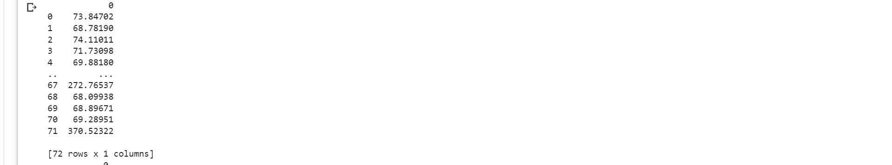

# Ex02-Outlier
# AIM

To identify given bhp.csv which contains property prices in the city of banglore, India. You need to examine price_per_sqft column and do following,

# PROCEDURE

(1) Remove outliers using IQR 

(2) After removing outliers in step 1, you get a new dataframe.

(3) use zscore of 3 to remove outliers. This is quite similar to IQR and you will get exact same result

(4) for the data set height_weight.csv find the following

    (i) Using IQR detect weight outliers and print them

    (ii) Using IQR, detect height outliers and print them
## CODE
```
import numpy as np
import pandas as pd


data = [73.84702,68.7819,74.11011,71.73098,69.8818,67.25302,68.78508,68.34852,67.01895,63.45649,71.19538,71.64081,64.76633,
        69.28307,69.24373,67.64562,72.41832,63.97433,69.64006,67.936,67.9150,69.43944,66.14913,375.20597,7.8932,68.14403,
        69.08963,72.80084,67.42124,68.49642,68.61811,74.03381,71.52822,69.18016,69.5772,70.40093,69.07617,67.19352,65.80732,
        34.30419,67.97434,72.18943,65.27035,66.09018,67.51032,70.10479,68.25184,72.17271,69.17986,72.87036,64.78258,70.18355,68.49145,
        67.33083,66.99094,66.49955,68.35306,70.77446,171.21592,70.01337,71.40318,69.55201,73.81853,66.99688,
       71.41847,65.2793,68.27419,272.76537,68.09938,68.89671,69.28951,370.52322]

df=pd.DataFrame(data)
print(df)
median=df.quantile(0.5)
Q1 = df.quantile(0.25)
Q3 = df.quantile(0.75)
IQR = Q3-Q1
low=Q1-1.5*IQR
high=Q3+1.5*IQR
df1=df[((df>=Q1-1.5*IQR)&(df<=Q3+1.5*IQR))]
print(df1)
```
## OUTPUT
IQR

## RESULT
The output of the program is excicuted successfully